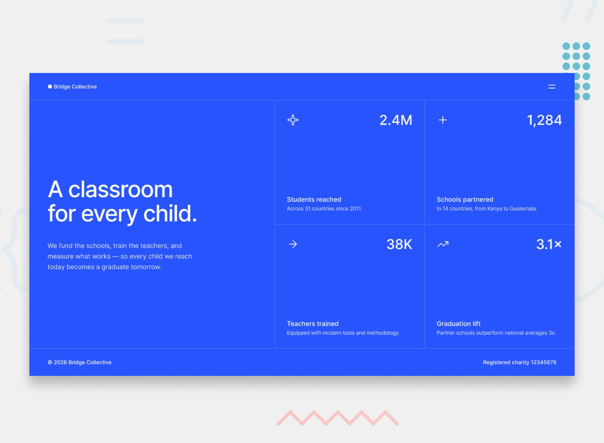

# Bridge Collective

A responsive landing page for a fictional education nonprofit. It introduces the organization and highlights its impact through four statistics, with a menu that can be opened and closed on mobile and desktop.

## Screenshot

## Links

- Repository: [github.com/Yahya-zakiri/grid-landing-page](https://github.com/Yahya-zakiri/grid-landing-page)
- Challenge: [Frontend Mentor - Grid landing page](https://www.frontendmentor.io/challenges/grid-landing-page)
- Live site: Not deployed yet

## Built with

- Semantic HTML5
- CSS custom properties
- CSS Grid and Flexbox
- Responsive media queries
- Vanilla JavaScript for the menu toggle

## What I learned

- CSS Grid can adapt content to different screen sizes: the impact statistics form a two-column grid on wider screens and stack on smaller screens.
- CSS custom properties make shared colors and type sizes easier to maintain.
- JavaScript can update the menu and its icons together by toggling CSS classes.